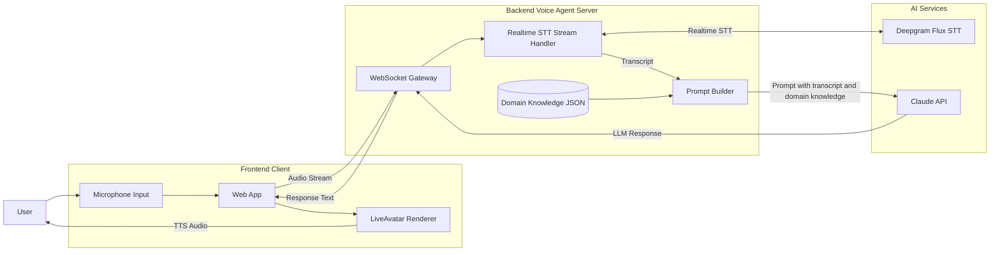
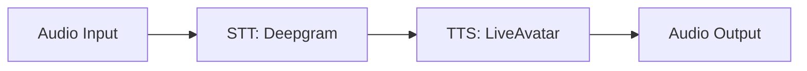

# cascaded voice agent spike (deepgram STT -> LiveAvatar TTS)


## architecture

### version 1 cascaded model



### version 2 frontend based cascaded model i went with (simplified and lighter)



domain knowledge/context comes from data/scenarios.ts array data structure, each prompt to LiveAvatar puts in the current scenario context

## notes

types of cascaded voice agent architectures/system models:
https://elevenlabs.io/blog/cascaded-vs-fused-models

thoughts:

- how to get the latency down as much as possible with cascaded voice agent systems/models?

## api docs notes:

use @heygen/liveavatar-web-sdk from npm for TTS
example repo for liveAvatar: https://github.com/heygen-com/liveavatar-web-sdk?tab=readme-ov-file
liveAvatar api docs: https://docs.liveavatar.com/docs/getting-started

liveAvatar configuration options:
Avatar (Visual Layer) — Defines what the avatar looks like. Choose from a wide selection of avatars, each with unique styles, appearances, and expressions.
Voice (Audio Layer) — Defines what the avatar sounds like. Choose a voices that fit your needs — from calm and professional to energetic or youthful.
Context (Cognitive Layer) — Defines how the avatar thinks and responds. Control the personality traits, background knowledge, and behavior, which guide how the LLM generates responses.
Interactivity Type (Conversational Layer) — Controls how/when you want the avatar to respond.

claude api (haiku 4.5) for lowest latency

deepgram flux docs: https://developers.deepgram.com/docs/flux/quickstart
see: https://github.com/deepgram-devs/deepgram-demos-flux-streaming for proxy web socket server demo code

## running

create a .env file and put your api keys in, see .env.example

```npm i```

```npm run dev```


# React + TypeScript + Vite

This template provides a minimal setup to get React working in Vite with HMR and some ESLint rules.

Currently, two official plugins are available:

- [@vitejs/plugin-react](https://github.com/vitejs/vite-plugin-react/blob/main/packages/plugin-react) uses [Babel](https://babeljs.io/) (or [oxc](https://oxc.rs) when used in [rolldown-vite](https://vite.dev/guide/rolldown)) for Fast Refresh
- [@vitejs/plugin-react-swc](https://github.com/vitejs/vite-plugin-react/blob/main/packages/plugin-react-swc) uses [SWC](https://swc.rs/) for Fast Refresh

## React Compiler

The React Compiler is not enabled on this template because of its impact on dev & build performances. To add it, see [this documentation](https://react.dev/learn/react-compiler/installation).

## Expanding the ESLint configuration

If you are developing a production application, we recommend updating the configuration to enable type-aware lint rules:

```js
export default defineConfig([
    globalIgnores(["dist"]),
    {
        files: ["**/*.{ts,tsx}"],
        extends: [
            // Other configs...

            // Remove tseslint.configs.recommended and replace with this
            tseslint.configs.recommendedTypeChecked,
            // Alternatively, use this for stricter rules
            tseslint.configs.strictTypeChecked,
            // Optionally, add this for stylistic rules
            tseslint.configs.stylisticTypeChecked,

            // Other configs...
        ],
        languageOptions: {
            parserOptions: {
                project: ["./tsconfig.node.json", "./tsconfig.app.json"],
                tsconfigRootDir: import.meta.dirname,
            },
            // other options...
        },
    },
]);
```

You can also install [eslint-plugin-react-x](https://github.com/Rel1cx/eslint-react/tree/main/packages/plugins/eslint-plugin-react-x) and [eslint-plugin-react-dom](https://github.com/Rel1cx/eslint-react/tree/main/packages/plugins/eslint-plugin-react-dom) for React-specific lint rules:

```js
// eslint.config.js
import reactX from "eslint-plugin-react-x";
import reactDom from "eslint-plugin-react-dom";

export default defineConfig([
    globalIgnores(["dist"]),
    {
        files: ["**/*.{ts,tsx}"],
        extends: [
            // Other configs...
            // Enable lint rules for React
            reactX.configs["recommended-typescript"],
            // Enable lint rules for React DOM
            reactDom.configs.recommended,
        ],
        languageOptions: {
            parserOptions: {
                project: ["./tsconfig.node.json", "./tsconfig.app.json"],
                tsconfigRootDir: import.meta.dirname,
            },
            // other options...
        },
    },
]);
```
